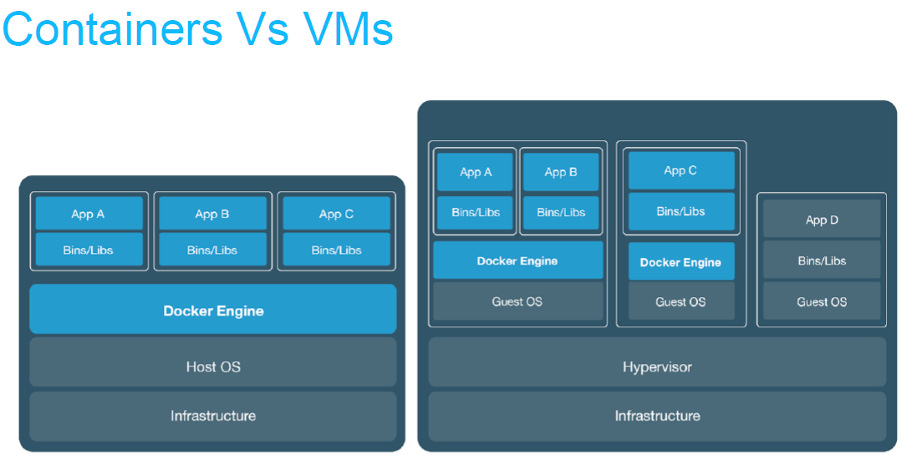
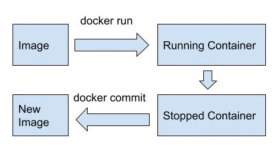

# COMP SCI 506 Docker Tutorial

### Why Docker

Docker provides the ability to package and run an application in a loosely isolated environment called a container.

### How it's different from VMs?



### First Docker Command:
```shell
$ docker run --name first_app -it ubuntu /bin/bash
```
An docker image was pulled from docker repository and an instance of images was run for us.
1. `-i` means interactive mode.
2. `-t` means attach to terminal.

### Docker Images
A Docker image is a read-only template that contains a set of instructions for creating a container that can run on the Docker platform.
```shell
$ docker images
REPOSITORY   TAG       IMAGE ID       CREATED       SIZE
ubuntu       latest    a6be1f66f70f   2 weeks ago   69.2MB
```

### How to change and save images?



#### 1. Modify something
```shell
$ apt update
$ apt install nano
$ echo "Hello" >> file.txt
$ exit
```
#### 2. See stopped containers
`-a` is required to show stopped containers.
```shell
$ docker ps -a
CONTAINER ID   IMAGE     COMMAND       CREATED          STATUS                        PORTS     NAMES
f2e4ba5f2c40   ubuntu    "/bin/bash"   31 seconds ago   Exited (127) 23 seconds ago             first_app
```
#### 3. Commit as new image
```shell
$ docker commit first_app first_image
sha256:9288ab09be67c8155b1f1ce550ded1b0f7213942f26c7d83f4b2deb4f8dd55b9
```
#### 4. Run as new container
```shell
$ docker run --name second_app -it first_image /bin/bash
root@b444b7b19f5c:/# ls
bin  boot  dev  etc  file.txt  home  lib  media  mnt  opt  proc  root  run  sbin  srv  sys  tmp  usr  var
root@b444b7b19f5c:/# cat file.txt
Hello
```
Want to share images with your friends? Push to Docker repositories - https://docs.docker.com/docker-hub/repos/

#### Another way to do things - Dockerfile
Docker can build images automatically by reading the instructions from a Dockerfile. A Dockerfile is a text document that contains all the commands a user could call on the command line to assemble an image. This page describes the commands you can use in a Dockerfile.

### Volumes (Way to share data)
Volumes are the 'virtual dics' for persisting data generated by and used by Docker containers. They can be shared between container and host as well.
Two flavors:
1. Persistent 
2. Ephemeral

They're NOT part of images.
#### Share with Host
```shell
$ docker run -v /Users/hsagar/Desktop/example:/shared_folder  --name third_app -it ubuntu /bin/bash
root@3e217b9b777c:/# ls
bin  boot  dev  etc  home  lib  media  mnt  opt  proc  root  run  sbin  shared_folder  srv  sys  tmp  usr  var
root@3e217b9b777c:/# cd shared_folder/
root@3e217b9b777c:/shared_folder# touch hello.txt
root@3e217b9b777c:/shared_folder# exit
exit
```
#### Share with Containers
Volumes-from :
1. Shared 'discs' that are available only till they're being used by some container.
2. Can be shared between containers

In first terminal:
```shell
$ docker run -v shared_volume --name fourth_app -it first_image /bin/bash
root@33824e1893d8:/# ls
bin  boot  dev  etc  file.txt  home  lib  media  mnt  opt  proc  root  run  sbin  shared_volume  srv  sys  tmp  usr  var
root@33824e1893d8:/# cd shared_volume/
root@33824e1893d8:/shared_volume# echo "Something" >> shared_volume_file.txt
root@33824e1893d8:/shared_volume# exit
exit
```

In second terminal:
```shell
docker run --volumes-from fourth_app --name fifth_app -it first_image /bin/bash
root@09681e5f9eae:/# ls
bin  boot  dev  etc  file.txt  home  lib  media  mnt  opt  proc  root  run  sbin  shared_volume  srv  sys  tmp  usr  var
root@09681e5f9eae:/# cat shared_volume/shared_volume_file.txt
Something
root@09681e5f9eae:/#
```

#### More useful commands
1. Delete an Image
```shell
docker rmi <image_name>
```
2. Remove container
```shell
docker rm <container_name>
```
3. Copy from container
```shell
docker cp <container_name>:<path_to_source> <path_to_target>
```
4. Start shell inside running container
```shell
docker exec -it <container_name> bash
```


### Very Easy Example
On terminal:
```shell
docker run --publish 3000:80 nginx
```
`name`: Name of the running instance

`p`: Publish a container's port(s) to the host for port mapping

`d`: Run container in background and print container ID

On Browser

http://localhost:3000/

### Easy Example
1. Git clone docker-compose tutorial 
```shell
$ git clone https://github.com/akshatgit/docker-compose-tutorial
```
2. Go through `app.py` and `Dockerfile`
3. Build custom docker image
```shell
$ docker build -t my-flask-app .
```
`-t`: image name
`.`: location of Dockerfile(run it from composetest dir)

Step 4: Run Redis and custom app
```shell
$ docker compose up
```
Step 5: Profit! (http://127.0.0.1:8000)

### Docker Compose:
1. Single machine Coordination
2. Designed for testing and development
3. Brings up containers, volumes, networks etc in single command.

What if I want to `orchestrate` more containers/machines? 
`Kubernetes` - https://kubernetes.io/

### To Dos:
1. Views counts are not persistent
2. If containers are killed and started back the counter will go back to 0
3. How do we store the views counter?


