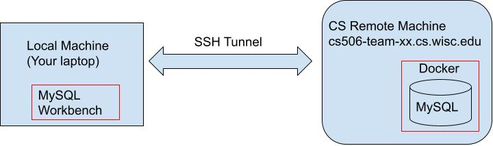
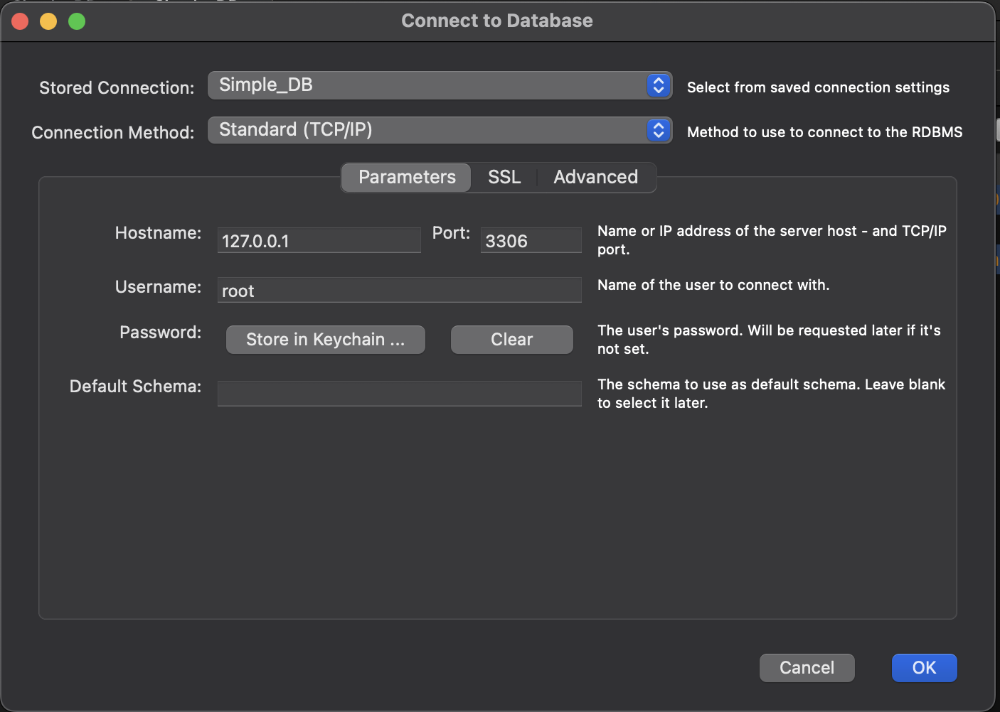
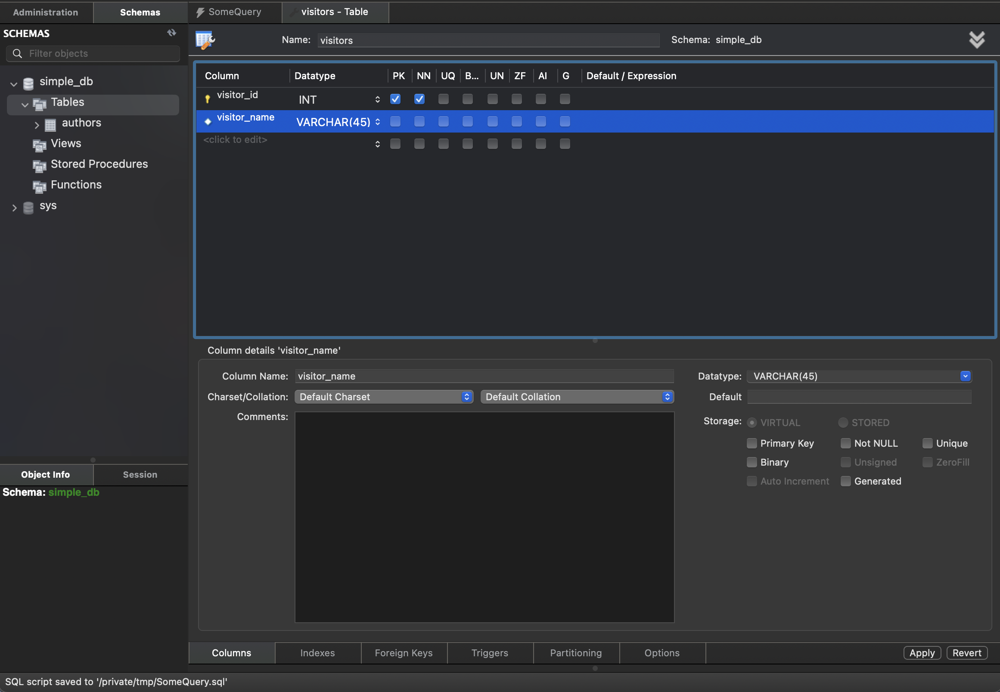
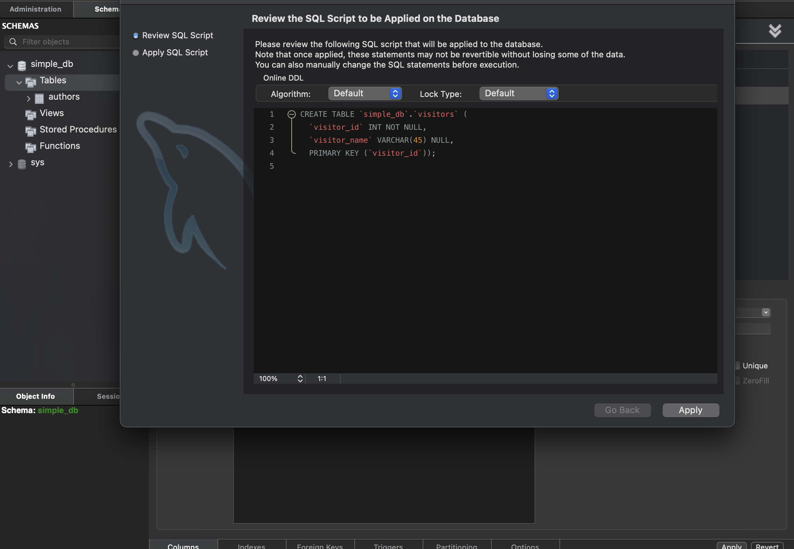
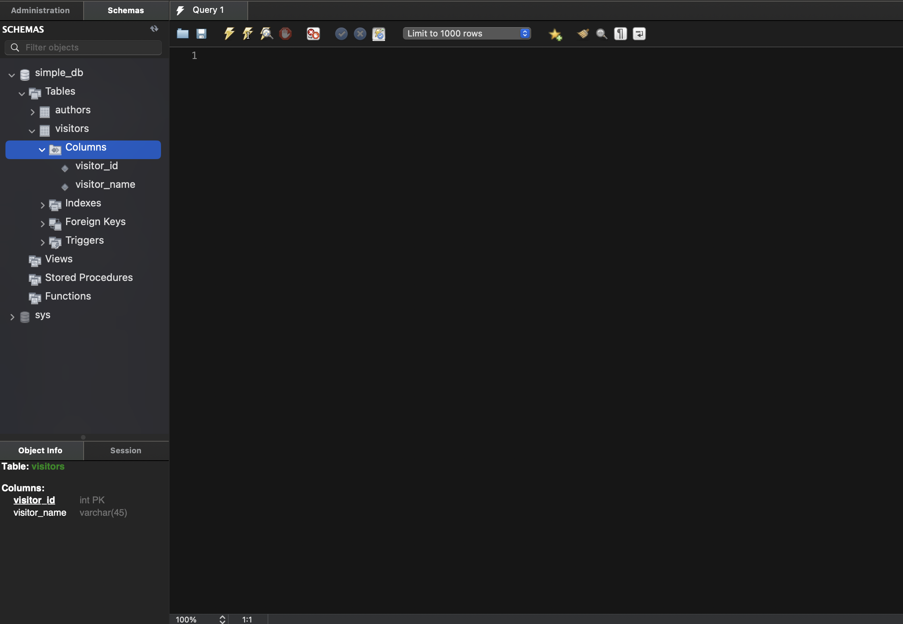
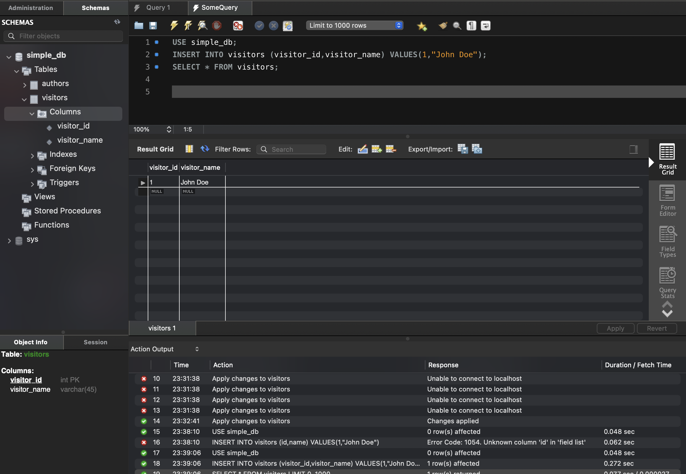
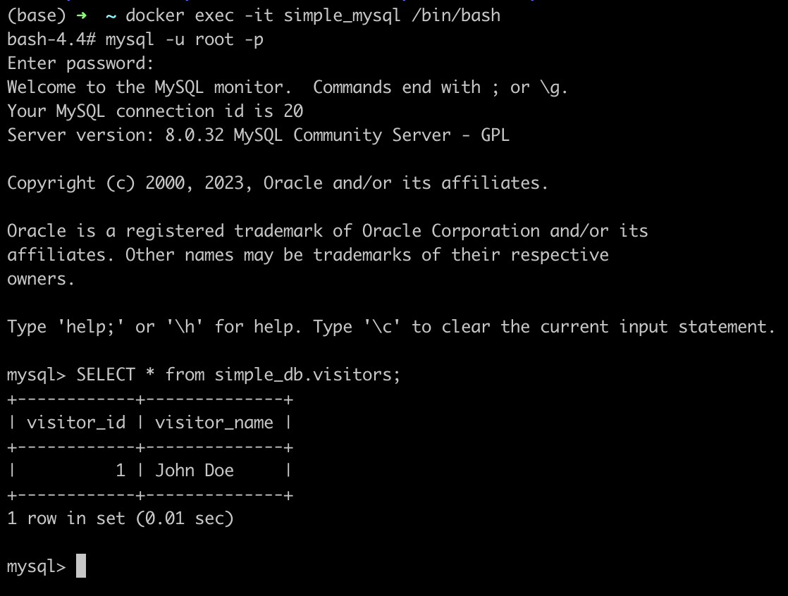

# COMP SCI 506 MySQL Tutorial

Objective:
To demonstrate accessing mysql database hosted on remote machine's docker container from mysql worbench installed on local machine.
Pictorially,



This tutorial assume students have access to Remote Machine(RM) i.e cs506-team-XX.cs.wisc.edu

### 0. Install Docker on Remote Machine(RM)
Refer to this tutorial for installing and learning basics of Docker
https://github.com/himanshusagar/CS506_Docker_Tutorial

### 1. Install MySQL WorkBench on Local Machine(RM)
Refer to this link for downloading and installing Workbench - https://www.mysql.com/products/workbench/

### 2. On Remote machine
#### 2.1 SSH to Remote Machine
```shell
ssh hsagar2@cs506-team-XX.cs.wisc.edu
````
#### 2.2 Run Docker Container
This command creates docker container and maps container's 3306 port to remote machine
s 3306 port. You may want to use volumes to persist data! - https://github.com/himanshusagar/CS506_Docker_Tutorial.

`simple_pwd` is password of your DB. CHANGE IT!

`simple_db` is name of your DB. CHANGE IT!

```shell
docker run --name simple_mysql --rm -e MYSQL_ROOT_PASSWORD=simple_pwd -e MYSQL_DATABASE=simple_db -e MYSQL_ROOT_HOST=%  -p 3306:3306 -it mysql
```
#### 2.3 Insert some data into DB
1. Open new terminal, ssh into remote machine again!
```shell
ssh hsagar2@cs506-team-00.cs.wisc.edu
````
2. SSH into container
```shell
docker exec -it simple_mysql /bin/bash
```
3. Connec to container's MySQL.
```shell
mysql -u root -p
```
4. Insert whatever password you used in step  2.2 Run Docker Container.
5. Run following queries for dummy data.
```sql
USE simple_db;
CREATE TABLE authors (id INT, name VARCHAR(20), email VARCHAR(20));
SHOW TABLES;
INSERT INTO authors (id,name,email) VALUES(1,"Himanshu Sagar","hsagar@abc.def");
SELECT * from authors;
```
5. Quit MySQL prompt
```sql
quit
```
6. Exit container's bash shell.
```shell
exit
```

### 3. On Local machine
Open a terminal.
#### 3.1 SSH Tunnel 
We need to SSH tunnel 3306 port of remote machine to local machine's 3306 port.
Use your username and machine name instead of `hsagar2` and `cs506-team-XX` respectively.
```shell
ssh -L 3306:cs506-team-XX.cs.wisc.edu:3306 hsagar2@cs506-team-XX.cs.wisc.edu
```
Enter CS Login Password and perform DUO authentication.

#### 3.2 Open Workbench
Open MySQL Workbench.

3.2.1: On Menu Bar(Top Bar), Click on `Database`.

3.2.2: Click on `Connect to DataBase`. 

3.2.3: Fill window with following details. Ensure:

0. Connection Method is Standard(TCP/IP)
1. Hostname is `127.0.0.1`
2. Port is `3306`
3. Username is `root`
4. Password is the one you specified in step 2.2 Run Docker Container.

Step D: Click 'Ok'.
Now, you should have connection to DB.


#### 3.2 Create New Schema using WorkBench
1. Use Schema Browser on Left Panel to and expand your DB(simple_DB).
2. Right Click on `Tables`.
3. Click on `Create Tables`.
4. Fill Create Table form as below:



5. Click Apply.
6. Verify SQL statement on review window.
   
7. Click Apply.
8. Verify Visitor's table in Left Panel Schema Browser.
   

#### 3.3 Using Query Files
1. Click on Query_1 window(It could be Query_2,3,4 etc as well).
2. Insert some data into visitors table using following lines. Copy-Paste them into query window.
```sql
USE simple_db;
INSERT INTO visitors (visitor_id,visitor_name) VALUES(1,"John Doe");
SELECT * FROM visitors;
```
3. Click on Apply. Result window should look like this:
   


### 4. On Remote machine
Let's verify whether we actually modified database inside docker container.
1. SSH to remote machine. 
```shell
ssh hsagar2@cs506-team-00.cs.wisc.edu
````
2. Run Bash Shell inside container
```shell
docker exec -it simple_mysql /bin/bash
```
3. Run MySQL Client.
```shell
mysql -u  root -p
```
3. Check Visitors Table as below. 
```sql
SELECT * from simple_db.visitors;
```
